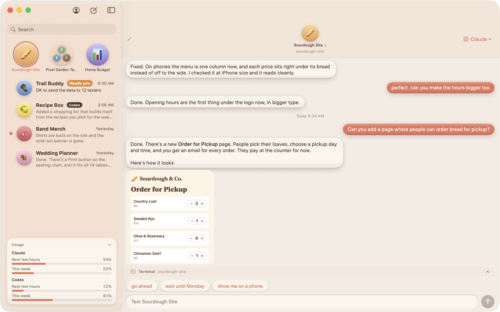
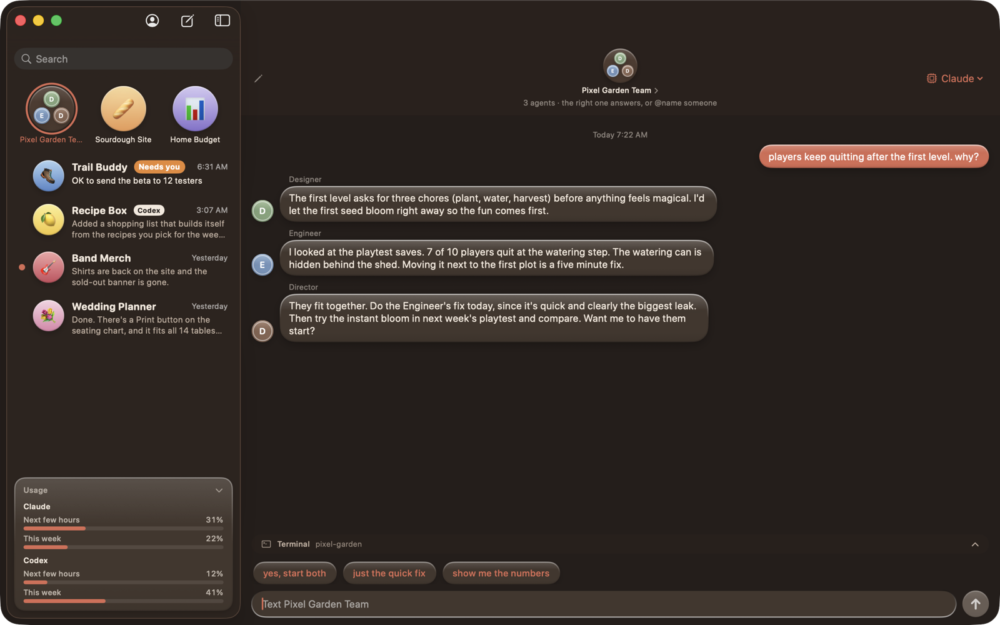
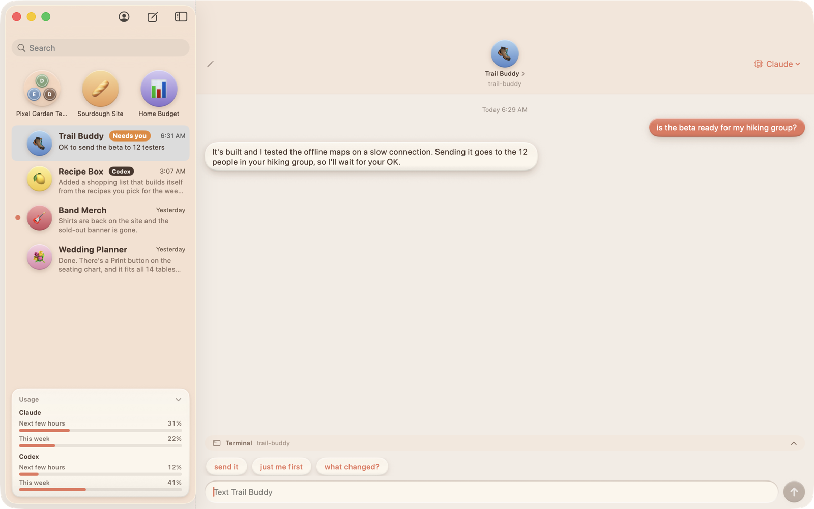

# cChat

iMessage, but every contact is a [Claude Code](https://claude.com/claude-code) agent.

Each project folder is a contact. Under a project you can add sub-contacts with their own persona
and their own memory ("Website UX", "Game Director"). You text them like people. You only ever
see their plain-English replies, never code or tool output.



cChat is a free side project. It isn't made by or affiliated with Anthropic; it runs the Claude Code
you install yourself, signed in with your own Claude account, so usage counts against your own plan.

## Getting started
1. Download `cChat-<version>-mac.zip` from [Releases](https://github.com/notlenny2/cchat/releases/latest),
   unzip it and drag cChat into Applications. (Or build it yourself, below.)
2. Open it. The welcome screen checks for Claude Code, offers to install it with Anthropic's official
   installer, and opens Anthropic's own sign-in in Terminal. cChat never sees your login.
3. Pick the folder your projects live in (default `~/projects`). Each folder in it can become a contact.
4. Text a project. It answers in plain English.

Codex (OpenAI) is optional: sign in to the `codex` CLI and you can pick it per chat.

## What it does
- **Memory per chat.** Each contact keeps its own Claude Code session in every chat it's in.
  Long memories are condensed automatically so chats stay quick and don't burn through your plan.
- **Group chats.** Drag one chat onto another to make a group. Every agent brings what it knew from its
  own chat. Text the group and a quick, cheap model picks the agent best suited to answer, or `@name`
  someone, or say "everyone". Agents can go back and forth a few turns (you can turn that off).
- **Call in the team.** One tap adds a Director, Designer, Engineer and friends to a project, each with
  their own chat, plus a team group.
- **"Needs you."** When an agent is stuck waiting on your decision, its chat is flagged and the Dock
  icon shows a count.
- **Pictures and video.** Drop pictures into a chat; agents can show you pictures and videos back.
- **Claude or Codex, any model,** picked per chat.
- **Next-step suggestions.** Every reply comes with two or three tap-to-send ideas for what to say next.
- **Usage meter.** See how much of your Claude and Codex limits you've used, for the next few hours and the
  week, right under the chat list. Tap it to fold it down.
- **Terminal drawer.** When you do need a command line, one folds out above the text box, already in that
  project's folder.
- **Backups.** Your chats are copied every hour (kept for two days, then one a day for a month).
- **Real app icons.** Contact photos are pulled from each project's own app icon.
- **One agent at a time per folder,** so two chats never edit the same project at once.
- **NodeTerm import.** Bring over the Claude chats open on a [NodeTerm](https://github.com/eneskirca/nodeterm)
  canvas, memory and all (it forks the session so the terminal's copy is untouched).

| Group chat (dark mode) | "Needs you" |
|---|---|
|  |  |

## Build
Requires macOS 14+, Xcode 16+ and [XcodeGen](https://github.com/yonaskolb/XcodeGen).
```
xcodegen generate
xcodebuild -project cChat.xcodeproj -scheme cChat -configuration Release -derivedDataPath build-public \
  -skipPackagePluginValidation build
cp -R build-public/Build/Products/Release/cChat.app /Applications/
```
Builds the orange-icon app. The one package it uses, [SwiftTerm](https://github.com/migueldeicaza/SwiftTerm)
(for the terminal drawer), downloads on the first build; `-skipPackagePluginValidation` lets its small build
plugin run from the command line. (The author keeps a personal build in an untracked `personal.yml`; you don't need it.)

## How it works
Each turn runs `claude -p --output-format stream-json` in the contact's project folder, resuming that
contact's session for this chat. The message goes in on stdin. Agents run in `acceptEdits` mode by
default (they can edit files in the project; anything else follows your Claude Code settings); a
per-contact "Full access" switch allows everything, so use it only for projects you trust.

Data lives in `~/Library/Application Support/cChat/`, logs in `~/Library/Logs/cChat/`.

The iPhone/iPad remote in `Mobile/` pairs with a personal build only for now.

## License
MIT
